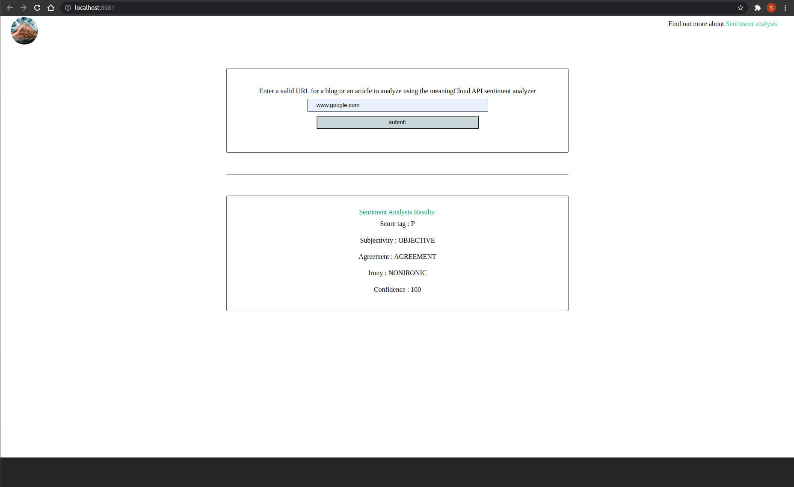

# Udacity ND project
## Evaluate news article using NLP - meaningCloud API

## Overview
This is the last project in Udacity React ND - advanced track in the FWD inititaive program. This project is focused on learning how to use webpack, webpack loaders and plugins, testing, SASS and other tools to build a nice dynamic web app. This web app uses an external API that evaluates text and returns analysis to the user. The user interface has an input space and a results section, and it's also interactive when user enters an invalid URL.

### run the App:
* Sign up at https://www.meaningcloud.com/developer/sentiment-analysis with your mail or any account, get an API key:
* Install the dotenv package:
- - npm install dotenv
- Create a new .env file in the root of your project
- Fill the .env file with your API key like this:
- - API_KEY=**************************

* install all project dependencies with `npm install` *or yarn install*
* start the development server with `npm run start` *or yarn run*
  -  http://localhost:55555/
## The project structure:
- project is webpack built with development environment and production environment configured separately in different config files for more stability, I also used "npm run build-dev" for development denvironemt and "npm run build-prod" for production envireonment. I used "web-dev-server" and other tools for better development and minifying everything. I also used server workers to enable offline functionality.

- The JavaScript is mainly used to set up the server (express and other tools) , managing the handler functions and validation function on the Client side and updating the UI after API responses.

- CSS and SASS are used chained in nested sass files for styling (simple styling)

- Assests and image used are from screenshots form the project built and http://unsplash.com 

## API - meaningcloud - Sentiment analysis:
Sentiment Analysis is MeaningCloud's solution for performing a detailed multilingual sentiment analysis of texts from different sources. The text provided is analyzed to determine if it expresses a positive/negative/neutral sentiment. Additionally, Sentiment Analysis detects if the text processed is subjective or objective and if it contains irony marks [beta] at a global level, giving the user additional information.

## Screnshots for the App:
### Valid-URL with results:

### Invalid-URL with warning:

- ## Code:
